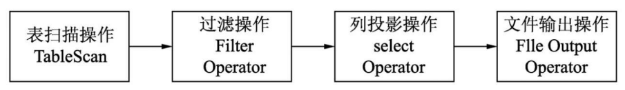

简单SQL指的是不含有列操作、条件过滤、UDF、聚合和连接等操作的SQL，这种类型的SQL在执行时只会用到Map阶段。对应的这一类型的SQL被归结为简单SQL：select -> from -> where型。

对于如下简单的SQL进行分析

```sql
explain
select
    id
from lefttable
where id < 4;
```

具体的执行计划如下所示：

```sql
STAGE DEPENDENCIES: -- 描述作业之间的依赖关系
  Stage-0 is a root stage

STAGE PLANS:
  Stage: Stage-0
    Fetch Operator
      limit: -1
      Processor Tree:
        TableScan -- 表遍历操作
          alias: lefttable
          -- 当前阶段的统计信息，处理1万行的数据，数据量是120bytes
          Statistics: Num rows: 1 Data size: 120 Basic stats: COMPLETE Column stats: NONE
          -- 在tablescan基础上进行过滤（filter 操作）
          Filter Operator
            -- predicate表示过滤操作的条件谓词
            predicate: (id = 1) (type: boolean)
            Statistics: Num rows: 1 Data size: 120 Basic stats: COMPLETE Column stats: NONE
            -- 在filter过滤结果集上进行列的筛选
            Select Operator
              -- 表示选择过滤的列，这里有1、id。由于在where子句中已经指定了
              -- id的条件是1，因而Hive直接将1替换为id列
              expressions: 1 (type: int)
              -- 输出了1列_col0
              outputColumnNames: _col0
              -- select 操作阶段的统计信息
              Statistics: Num rows: 1 Data size: 120 Basic stats: COMPLETE Column stats: NONE
              ListSink

Time taken: 0.211 seconds, Fetched: 20 row(s)

```

从上述执行计划可知，整个SQL只有Map操作树（Map Operator Tree），如果转换成mapreduce来看的话，则只有map阶段的任务。在Map阶段的运行逻辑如下图所示：



上图表示的就是上述简单SQL的Map阶段操作过程。

对于所有的select-from-where类型的SQL都只有Map阶段的操作，这是因为这类SQL只有从表中读取数据并执行数据行的过滤，并没有需要将分布式文件存储在其他节点的数据与该节点的数据放在一起处理的必要，因此这类的SQL不需要进行reduce操作，map阶段过滤后的数据，就是最终的结果数据。

此外，对于这种只包含Map的操作，如果文件大小在控制合适的情况下都将只有本地操作。这是一种非常高效的方法，运行效率完全不输于在计算引擎tez或者spark上运行。

为了更加清楚的理解SQL的执行过程，我们可以将上述SQL使用mapredue实现，

```java
public class GrepMain {

    public static class SimpleSQLMapper extends Mapper<Object, Text, NullWritable,Text> {
        private String matchGrep = null;
	    private final static Text outV = new Text();
        public void map(Object key,Text value,Context context) {
            String[] splits = value.toString().split(",");
            outV.set(split[0]);
            if(id < 4) {
                context.write(NullWritable.get(), outV);
            }
        }
    }

    public static void main(String[] args) {
        Configuration conf = new Configuration();
        Job job = Job.getInstance(conf, "job 1");
        job.setJarByClass(Job1.class);
        job.setMapperClass(SimpleSQLMapper.class);
        job.setOutputKeyClass(NullWritable.class);
        job.setOutputValueClass(Text.class);
	    // 将reduce个数设置为0
        job.setNumReduceTasks(0);
        FileInputFormat.addInputPath(job, new Path(args[0]));
        FileOutputFormat.setOutputPath(job, new Path(args[1]));

        System.exit(job.waitForCompletion(true) ? 0 : 1);
    }
}
```

