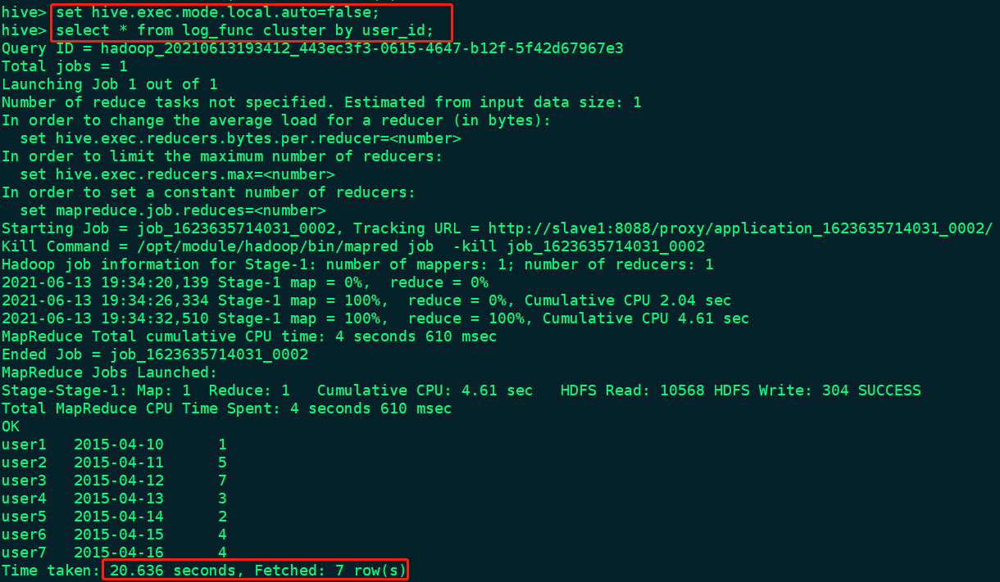
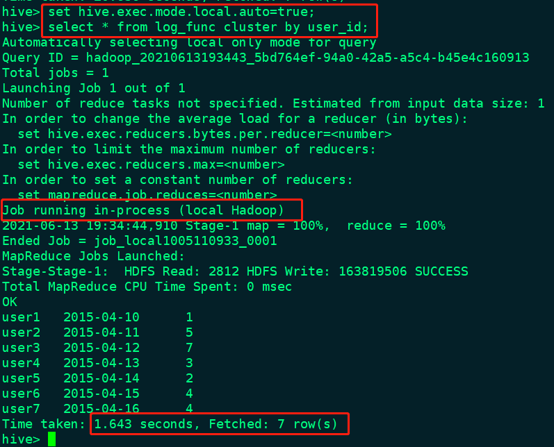

# Hive本地模式

## 1.fetch

可参考文章[fetch](1.fetch.md)

hadoop有三种运行模式：standalone模式、伪分布式模式、完全分布式模式。在大多数情况下，我们需要使用完全分布式模式处理大数据集。但是在完全分布式模式下，当我们要处理的数据集非常小的时候，为查询触发执行任务时消耗可能会比实际job的执行时间要多的多。hve0.7版本之后，Hive可以通过本地模式在单台机器上处理所有的任务。对于小数据集，执行时间可以明显被缩短。

```shell
# 1.开启本地mr,默认是关闭的
SET hive.exec.mode.local.auto=true; -- default false
# 2.设置local mr的最大输入数据量，当输入数据量小于这个值时采用local  mr的方式，默认为134217728，即128M
SET hive.exec.mode.local.auto.inputbytes.max=50000000;
# 3.设置local mr的最大输入文件个数，当输入文件个数小于这个值时采用local mr的方式，默认为4
SET hive.exec.mode.local.auto.input.files.max=5; -- default 4
```

## 1.关闭本地模式



## 2.开启本地模式



从上述两个操作中不难发现，开启本地模式耗时明显降低。

注意：我们开启本地模式，还需要满足如下三个条件才能在本地模式运行任务：

* **输入数据量**：我们用参数hive.exec.mode.local.auto.inputbytes.max来指定本地模式处理的最大输入数据，默认为128MB；
* **Mapper的数量**：参数hive.exec.mode.local.auto.tasks.max指定了本地模式下Mapper的最大数量，默认为4；
* **Reducer的数量**：Reducer数量必须是0或1；

