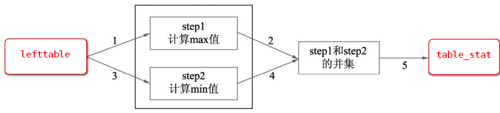
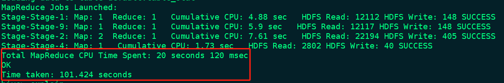

# union优化

## 1.union案例

```sql
--开启动态分区
set hive.exec.dynamic.partition=true;
set hive.exec.dynamic.partition.mode=nonstrict;

--找出各个年龄段最早和最晚出生的信息，并将这两部分信息使用union进行合并写入student_stat中
explain
insert into table table_stat
select id, max(value) stat, 'max' tp
from lefttable a
group by id
union all
select id, max(value) stat, 'min' tp
from lefttable b
group by id;
```

其执行结果如下图所示：


从SQL执行结果来看，一个共有5个Job对应4个MapReduce（MR）的任 务。

```shell
# 1.SQL语句
hive> insert into table table_stat
    > select id, max(value) stat, 'max' tp
    > from lefttable a
    > group by id
    > union all
    > select id, max(value) stat, 'min' tp
    > from lefttable b
    > group by id;
Query ID = hadoop_20210614020638_4724ed74-5b1c-4c77-b60b-0d60c3d62929
# 2.job数量
Total jobs = 5
Launching Job 1 out of 5
Number of reduce tasks not specified. Estimated from input data size: 1
 # 3.第1个job
Starting Job = job_1623660723190_0003, Tracking URL = http://slave1:8088/proxy/application_1623660723190_0003/
Kill Command = /opt/module/hadoop/bin/mapred job  -kill job_1623660723190_0003
Hadoop job information for Stage-1: number of mappers: 1; number of reducers: 1
2021-06-14 02:06:47,027 Stage-1 map = 0%,  reduce = 0%
2021-06-14 02:07:01,526 Stage-1 map = 100%,  reduce = 0%, Cumulative CPU 2.18 sec
2021-06-14 02:07:11,843 Stage-1 map = 100%,  reduce = 100%, Cumulative CPU 5.24 sec
MapReduce Total cumulative CPU time: 5 seconds 240 msec
Ended Job = job_1623660723190_0003
 # 3.第2个job
Launching Job 2 out of 5
Number of reduce tasks not specified. Estimated from input data size: 1
Starting Job = job_1623660723190_0004, Tracking URL = http://slave1:8088/proxy/application_1623660723190_0004/
Kill Command = /opt/module/hadoop/bin/mapred job  -kill job_1623660723190_0004
Hadoop job information for Stage-9: number of mappers: 1; number of reducers: 1
2021-06-14 02:07:24,962 Stage-9 map = 0%,  reduce = 0%
2021-06-14 02:07:31,177 Stage-9 map = 100%,  reduce = 0%, Cumulative CPU 3.32 sec
2021-06-14 02:07:45,610 Stage-9 map = 100%,  reduce = 100%, Cumulative CPU 5.89 sec
MapReduce Total cumulative CPU time: 5 seconds 890 msec
Ended Job = job_1623660723190_0004
 # 3.第3个job
Launching Job 3 out of 5
Number of reduce tasks determined at compile time: 1
Starting Job = job_1623660723190_0005, Tracking URL = http://slave1:8088/proxy/application_1623660723190_0005/
Kill Command = /opt/module/hadoop/bin/mapred job  -kill job_1623660723190_0005
Hadoop job information for Stage-2: number of mappers: 2; number of reducers: 1
2021-06-14 02:07:57,862 Stage-2 map = 0%,  reduce = 0%
2021-06-14 02:08:12,306 Stage-2 map = 50%,  reduce = 0%, Cumulative CPU 2.51 sec
2021-06-14 02:08:17,508 Stage-2 map = 100%,  reduce = 0%, Cumulative CPU 5.63 sec
2021-06-14 02:08:19,565 Stage-2 map = 100%,  reduce = 100%, Cumulative CPU 8.33 sec
MapReduce Total cumulative CPU time: 8 seconds 330 msec
Ended Job = job_1623660723190_0005
Stage-5 is filtered out by condition resolver.
Stage-4 is selected by condition resolver.
Stage-6 is filtered out by condition resolver.
 # 3.第4个job
Launching Job 5 out of 5
Number of reduce tasks is set to 0 since there's no reduce operator
Starting Job = job_1623660723190_0006, Tracking URL = http://slave1:8088/proxy/application_1623660723190_0006/
Kill Command = /opt/module/hadoop/bin/mapred job  -kill job_1623660723190_0006
Hadoop job information for Stage-4: number of mappers: 1; number of reducers: 0
2021-06-14 02:08:32,501 Stage-4 map = 0%,  reduce = 0%
2021-06-14 02:08:38,683 Stage-4 map = 100%,  reduce = 0%, Cumulative CPU 1.71 sec
MapReduce Total cumulative CPU time: 1 seconds 710 msec
Ended Job = job_1623660723190_0006
 # 3.第5个job,只有map阶段，没有reduce阶段，将结果数据写入目标表中
Loading data to table default.table_stat
MapReduce Jobs Launched: 
Stage-Stage-1: Map: 1  Reduce: 1   Cumulative CPU: 5.24 sec   HDFS Read: 12211 HDFS Write: 148 SUCCESS
Stage-Stage-9: Map: 1  Reduce: 1   Cumulative CPU: 5.89 sec   HDFS Read: 12126 HDFS Write: 148 SUCCESS
Stage-Stage-2: Map: 2  Reduce: 1   Cumulative CPU: 8.33 sec   HDFS Read: 22213 HDFS Write: 405 SUCCESS
Stage-Stage-4: Map: 1   Cumulative CPU: 1.71 sec   HDFS Read: 2807 HDFS Write: 40 SUCCESS
# 表示运行程序所占用服务器CPU资源的时间。	 
Total MapReduce CPU Time Spent: 21 seconds 170 msec	 
OK
# 记录的是用户从提交作业到返回结果期间用户等待的所有时间。
Time taken: 122.227 seconds
```

从上面打印的返回结果可以看到一个共有5个Job对应4个MapReduce（MR）的任 务，即Stage-Stage-1、 Stage-Stage-9、 Stage-Stage-2和 Stage-Stage-4对应mapreduce任务。

## 2.union数据流分析



注意：图中的数字仅代表执行顺序。

任务分析：

（1）job1，读取`lefttable`表数据，计算value的max值，并写入临时区；

（2）job2，读取`lefttable`表数据，计算value的min值，并写入临时区；

（3）job3，计算job1和job2结果的并集；

（4）job4，把job3得到的结果写入table_stat中；

下面我们看一下SQL的执行计划：

```shell
hive> explain
    > insert into table table_stat
    > select id, max(value) stat, 'max' tp
    > from lefttable a
    > group by id
    > union all
    > select id, max(value) stat, 'min' tp
    > from lefttable b
    > group by id;
STAGE DEPENDENCIES:
  Stage-1 is a root stage
  Stage-2 depends on stages: Stage-1, Stage-9
  Stage-8 depends on stages: Stage-2 , consists of Stage-5, Stage-4, Stage-6
  Stage-5
  Stage-0 depends on stages: Stage-5, Stage-4, Stage-7
  Stage-3 depends on stages: Stage-0
  Stage-4
  Stage-6
  Stage-7 depends on stages: Stage-6
  Stage-9 is a root stage

STAGE PLANS:
# job1: 读取lefttable表数据，计算value的max值，并写入临时区；
  Stage: Stage-1
    Map Reduce
      Map Operator Tree:
          TableScan
            alias: a
      Execution mode: vectorized
      Reduce Operator Tree:
      ...
# job3，计算job1和job2结果的并集；
  Stage: Stage-2
    Map Reduce
      Map Operator Tree:
          TableScan
            Union
              Statistics: Num rows: 2 Data size: 240 Basic stats: COMPLETE Column stats: NONE
              ...
          TableScan
            Union
              Statistics: Num rows: 2 Data size: 240 Basic stats: COMPLETE Column stats: NONE
              ...
      Reduce Operator Tree:
        Group By Operator
          aggregations: compute_stats(VALUE._col0)
          			   , compute_stats(VALUE._col1)
          			   , compute_stats(VALUE._col2)
          mode: mergepartial
          outputColumnNames: _col0, _col1, _col2
		 ...
		 
  Stage: Stage-8
    Conditional Operator
    
  Stage: Stage-5
    Move Operator
      files:
          hdfs directory: true
          destination: hdfs://master:9000/user/hive/warehouse/table_stat/.hive-staging_hive_2021-06-14_02-32-53_933_6748335440736481969-1/-ext-10000

  Stage: Stage-0
    Move Operator
      tables:
          replace: false
          table:
              name: default.table_stat

  Stage: Stage-3
    # 统计工作
    Stats Work
      Basic Stats Work:
      Column Stats Desc:
          Columns: id, value, stat
          Column Types: int, string, string
          Table: default.table_stat
############################
  Stage: Stage-4
    Map Reduce
      Map Operator Tree:
          TableScan
            File Output Operator
              compressed: false
              table:
                  name: default.table_stat
  Stage: Stage-6
    Map Reduce
      Map Operator Tree:
          TableScan
            File Output Operator
              compressed: false
              table:
                  name: default.table_stat
############################
  Stage: Stage-7
    Move Operator
      files:
          hdfs directory: true
          destination: hdfs://master:9000/user/hive/warehouse/table_stat/.hive-staging_hive_2021-06-14_02-32-53_933_6748335440736481969-1/-ext-10000
# job2: 读取lefttable表数据，计算value的max值，并写入临时区；
  Stage: Stage-9
    Map Reduce
      Map Operator Tree:
          TableScan
            alias: b
```

## 3.性能分析

在大数据计算领域，分布式计算和分布式存储会消耗大量的磁盘IO和网络IO资源，这部分资源往往成为了大数据作业的瓶颈所在。



从SQL执行输出来看，CPU使用率很少，磁盘和网络读写耗时严重。所以，一个优化点就在于如何降低作业对I/O资源的消耗上。mapreduce任务的一个明显的缺点是：启动一次作业需要多次读、写磁盘，因为MR程序会将中间结果写入磁盘，而且为了保障磁盘的读写效率和网络传输效率，会进行多次排序。

而如果SQL包含多个job，那么job和job之间的中间结果也会先写到磁盘上。那么，只要我们减少中间结果的产生，也就能够达到降低I/O资源消耗，提升程序效率。

所以，针对当前SQL任务，优化点在于：减少或者避免中间结果集的产生。

**（1）优化1：减少中间结果集的产生**

```sql
insert into table table_stat
select id, max(value) stat, 'max' tp
from lefttable a
group by id

-- 改进：将union为insert into语句
insert into table table_stat
select id, min(value) stat, 'min' tp
from lefttable b
group by id;
```

改进之后的union数据流如下图所示：


（2）优化2：同一个表扫描两次，可以优化

step1和step2都是对lefttable数据进行计算，一个是max值，一个是min值。在计算的时候需要查询表两次，这是相当冗余的操作。如果表数据量很大，那么从表中取数（读取磁盘的数据）的时间将边得非常长，同样也浪费了集群宝贵的IO资源。

对源表取数操作的优化：

```sql
-- 2.改进：对源表取数操作的优化
from lefttable

insert into table table_stat
select id, max(value) stat, 'max' tp
group by id

-- 1.改进：将union为insert into语句
insert into table table_stat
select id, min(value) stat, 'min' tp
group by id;
```

优化之后的数据流如下图所示：


注意上述SQL执行会报错：


多次insert into的语法，在动态分区的情况下，可以使用：

```sql
-- 创建分区表
create table table_stat_pt(id int, value string) 
partitioned by (tp string);

-- SQL
from lefttable
insert into table table_stat_pt
select id, max(value) stat, 'max' tp
group by id
insert into table table_stat_pt
select id, min(value) stat, 'min' tp
group by id;
```

其执行日志显示，总共有3个job：


整个过程集中在磁盘IO和网络IO的优化上，在硬件资源保持不变的情况下，随着数据量的增加，整个集群的磁盘和网络压力会更大，通过优化的方式能够明显的节省时间。

优化之后的SQL需要3个job，而未优化之前启动了5个job。每启动一个一个job，就说明集群多执行了一次mapreduce作业，mapreduce作业越多则代表数据就要经历更多次的磁盘读写和网路通信。随着数据量的增多，磁盘和网络IO的负载会越来越大，耗在每个mapreduce过程的时间延迟也会越来越长。	