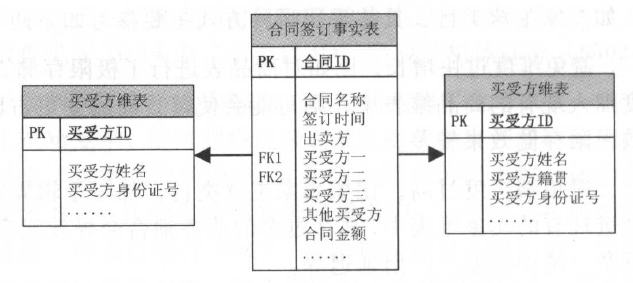
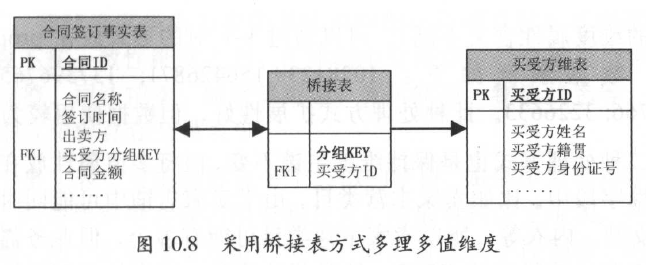
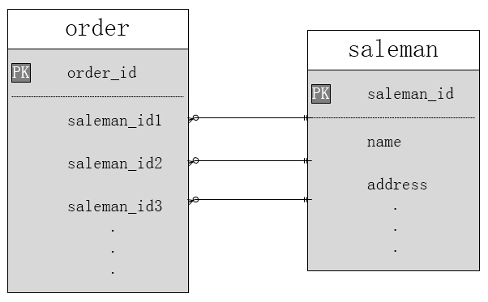
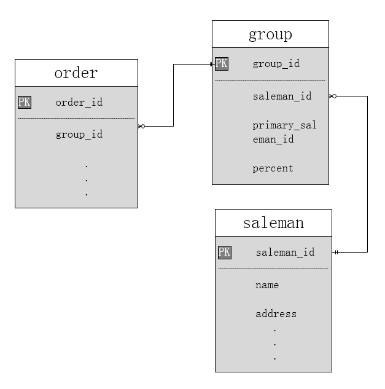

## 1.多值维度

在维度建模的数据仓库中，有一种维度表叫multivalue dimension，中文一般翻译为“多值维度”。比如对于淘宝交易订单，买家一次购买了多种商品，如一件毛衣和两双袜子，称为交易父订单： 对于每种商品的交易，称为交易子订单：此交易父订单有两个子订单与之对应。假设设计交易父订单事实表，则对于此事实表的每一条记录，在商品表中都有一到多条记录与之对应。

针对多值维度，常见的处理方式有三种，可以根据业务的表现形式和统计分析需求进行选择。

- 第一种是降低事实表的粒度。
- 第二种是处理方式是采用多字段。
- 第三种处理方式是采用较为通用的桥接表。

下面我们通过举例来说明这三种情况，

（1）降低事实表的粒度

在淘宝交易中，前台业务和商业智能关注交易子订单，所以在数据仓库模型设计中，将交易订单设计为子订单粒度，对于每个子订单，只有一种商品与之对应。对于其中的事实，则采用分摊到子订单的方式来解决。但很多时候，事实表的粒度是不能降低的，多值维度的出现是无法避免的。

（2）采用多字段

比如在房地产销售中，每次合同签订都可能存在多个买受方的情况，如夫妻合买等。对于合同签订事实表，每条记录可能对应多个买受方，而合同已经是此事实中的最细粒度，无法通过降低粒度的方式来解决。由于合同签订的买受人一般不会太多，所以一般采用多字段方式。考虑到扩展性，可以通过预留宇段的方式，如超过三个买受方时，其余买受方填写至“其他买受方”字段。模型设计如下图所示：

（3）桥接表

桥接表方式更加灵活、扩展性更好，但逻辑复杂、开发和维护成本较高，可能带来双重计算的风险，选择此方式需慎重。

通过在事实表和维表之间开发一个分组表，通过此分组表建立连接。模型设计如下图所示，其中桥接表包含和事实表关联的分组KEY，以及作为买受方维表外键的买受方ID 。

如果事实表的一条记录对应两个买受方，则桥接表针对这两个买受方建立两条记录，分组KEY 相同。

假设根据买受方籍贯统计2015 年的合同总金额，如果某合同有两个买受方，籍贯分别是浙江和山东，那么此合同总金额将会分别统计浙江和山东的，造成双重计算。双重计算不一定是错误，对于一些业务需求是合理的；但对于另一些业务需求，则需要规避。

## 2.多值维度实践

需求：在数仓建设过程中可能会遇到事实表中的一行对应维度表中多行的情况，产生多值维度，例如一个订单由多名销售人员共同完成。下面有两种处理方式：

### 2.1 多字段处理方式

> 思路：在事实表中增加多个字段来标记同一个订单的同种维度值。

多字段处理方法优劣分析：

* 优点：好维护，结构清晰，易理解；
* 缺点：只适合固定数目的场景，如果是不固定数目的销售人员，在事实表中就不知道要建立多少个销售人员的字段，且即使设置了最多的销售人员个数，就可能会造成很多字段的稀疏；

使用不方便，若希望得到某个销售人员的订单数，得遍历所有此类字段。

### 2.2 桥接表

group桥接表中存放每个订单的销售人员，每个订单对应一个销售组；percent是分配因子，用于分配每个销售人员的贡献度（可以避免多重计算）；

桥接表处理方法优劣分析：

（1）优点

* 灵活简化了生成报表的难度；
* 借分配因子避免了多重计算；

（2）缺点

* 桥接表的维护比较复杂，当出现一个新组合时，得先判断桥接表中是否已存在；

对于缓慢变化维的影响：

* 多字段处理方式：按照常规方式处理即可；
* 桥接表处理方式：一旦saleman变化的属性需要插入新记录时，该销售人员若有新的订单，就需要在group中新增一条记录。

参考资料：

[阿里巴巴大数据之路]()

[多值维度设计](https://my.oschina.net/u/4010291/blog/3056255)

