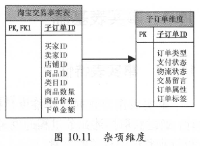

## 1.杂项维度

杂项维度是对低粒度标志和指标的分组，一般不在一致性维度之列。简单地说，杂项维度就是一种包含的数据具有很少可能值的维度。事务型商业过程通常产生一系列混杂的、低基数的标志位或状态信息。与其为每个标志或属性定义不同的维度，不如建立单独的将不同维度合并到一起的杂项维度。

通俗的做法就是将一些具有有限枚举值的字段值拼接在一起作为一行或者是多个字段的可能值不进行拼接而是作为多列组合，最后在杂项维度行中呈现。

在操作系统中，我们定义好各种维度后，通常还会剩下一些在小范围内取离散值的指示符或者标志字段。例如：支付类型字段，包括现金和信用卡两种类型，在源系统中它们可能是维护在类型表中，也可能直接保存在交易表中。

处理这些较低基数的标志或者状态位可以采用以下几种方法：

* 忽略法，但是你也不知道这些维度信息到底有没有用，所以不要轻易剔除或者忽略；
* 冗余法（维度退化），将这些维度信息冗余到事实表中。但是，会导致事实表占用空间过大；
* 每个维度字段单独建立一张维表，将代理键放在事实表中，但是这种方式比较复杂，容易出错，关联太多。一个经验是：如果外键的数量处于合理的范围中，即不超过20个，则在事实表中增加不同的外键是可以接受的。但是，若外键列表已经很长，则应该避免将更多的外键加入到事实表中。

杂项维度也可以用于解决该类问题，将这些字段建立到一个维度表中，在事实表中只需保存一个外键即可。多个字段的不同取值组成一条记录，生成代理键，存入维度表，并将该代理键保存入相应的事实表字段。

杂项维度个人理解：比如不同的字段，假如有3个：是否学生，是否运动，是否南方人，这三个字段的枚举值按照实际发生在元数据中的值进行拼接到一个字段或者分别作为三个字段在一行中呈现（应该是有9种组合）。

关于杂项维度的一个微妙的问题是，是否应该事先为所有组合的完全笛卡尔积建立行，或者是建立杂项维度行，用于保存那些遇到情况的数据。答案要看大概有多少可能的组合，最大行数是多少。一般来说，理论上组合的数量大而且不太可能用到全体组合的时候，当遇到新标志或指标组合时建立杂项维度行。当然，如果源数据中用到了全体组合时，那别无选择只能预先装载好全部杂项维度数据。

建议不要直接使用所有的组合生成完整的杂项维度表，在抽取时遇到新的组合时生成相应记录即可。杂项维度的ETL过程比一般的维度略为复杂。

## 2.文本事实

但是，杂项维度不仅包含上述指示符、状态或分类等枚举宇段，还包含很多非枚举字，如交易留言、交易属性（由若干k-v 对组成）、交易标签（由二进制位标识）等。针对这些字段，不可能生成所有的组合。同时，由于在分布式计算系统中生成代理键的复杂度，一般在逻辑建模中，会使用实体的主键作为杂项维度的主键。只考虑杂项维度，忽略其他维度，如图下图所示：



当遇到文本型（非枚举）的事实时，我们首先要考虑的应该是这个事实是否属于某个维度表。例如，客户类型标识出每个客户的一个值，应该属于客户维度表。

如果事实不属于已存在的任何一个维度表，我们可以为它们建立单独的维度表或者整合成杂项维度表（Junk Dimension）。建立单独的小维度表是比较容易的方式，但是为增加事实表中的外键个数。这样的维度比较多时，我们可以建立杂项维度表。下面列举了不同情况的一些说明。

1、如果事实表中的维度外键已经很多，如20个左右，那么最好建立杂项维度表。

2、理想情况下，杂项维度的记录数不要超过10万条。如果建立了杂项维度记录过多，可以考虑拆分成独立的维度或者其他杂项维度。

3、从业务规则角度讲，杂项维度中的不同属性应该是不相关的，以免引起误解。如果相关的话，最好不要建立成杂项维度。

## 3.杂项维度实践

现有的数据仓库新增一个销售订单属性杂项维度。需要新增一个名为sales_order_attribute_dim的杂项维度表，该表包括四个yes-no列：

* 审核标志-verification_ind
* 信用检查标志-credit_check_flag
* 客户首个订单标志-new_customer_ind
* 线上订单标志-web_order_flag。

每个列可以有两个可能值中的一个，Y 或 N，因此sales_order_attribute_dim表最多有16（2^4）行。假设这16行已经包含了所有可能的组合，并且不考虑杂项维度修改的情况，则可以预装载这个维度，并且只需装载一次。

```sql
-- 1.创建销售订单表，增加杂项属性
create external table sales_order    
(     
    order_number            int,        
    customer_number         int,        
    product_code            int,   
    verification_ind        string,
    credit_check_flag       string,
    new_customer_ind        string,
    web_order_flag          string, 
    order_date              string,  
    request_delivery_date   string,  
    entry_date              string,        
    order_amount            decimal(10 , 2 ),    
    order_quantity          int   
);

-- 2.建立杂项维度表    
create table sales_order_attribute_dim (    
     sales_order_attribute_sk    int         comment '杂项维度代理键'    
    ,verification_ind            string      comment '审核标志'        
    ,credit_check_flag           string      comment '信用检查标志'       
    ,new_customer_ind            string      comment '客户首个订单标志'        
    ,web_order_flag              string      comment '线上订单标志'
);    

-- 3.生成杂项维度数据，共插入16条记录    
insert into sales_order_attribute_dim values (1, 'n', 'n', 'n', 'n');  
insert into sales_order_attribute_dim values (2, 'n', 'n', 'n', 'y');  
insert into sales_order_attribute_dim values (3, 'n', 'n', 'y', 'n');  
insert into sales_order_attribute_dim values (4, 'n', 'n', 'y', 'y');  
insert into sales_order_attribute_dim values (5, 'n', 'y', 'n', 'n');  
insert into sales_order_attribute_dim values (6, 'n', 'y', 'n', 'y');  
insert into sales_order_attribute_dim values (7, 'n', 'y', 'y', 'n');  
insert into sales_order_attribute_dim values (8, 'n', 'y', 'y', 'y');  
insert into sales_order_attribute_dim values (9, 'y', 'n', 'n', 'n');  
insert into sales_order_attribute_dim values (10, 'y', 'n', 'n', 'y');  
insert into sales_order_attribute_dim values (11, 'y', 'n', 'y', 'n');  
insert into sales_order_attribute_dim values (12, 'y', 'n', 'y', 'y');  
insert into sales_order_attribute_dim values (13, 'y', 'y', 'n', 'n');  
insert into sales_order_attribute_dim values (14, 'y', 'y', 'n', 'y');  
insert into sales_order_attribute_dim values (15, 'y', 'y', 'y', 'n');  
insert into sales_order_attribute_dim values (16, 'y', 'y', 'y', 'y');
```


参考链接：

[阿里巴巴大数据之路]()

[数据仓库专题（10）-文本事实和杂项维度](https://cloud.tencent.com/developer/article/1383074)

[HAWQ取代传统数仓实践（十）——维度表技术之杂项维度](https://cloud.tencent.com/developer/article/1012227)


