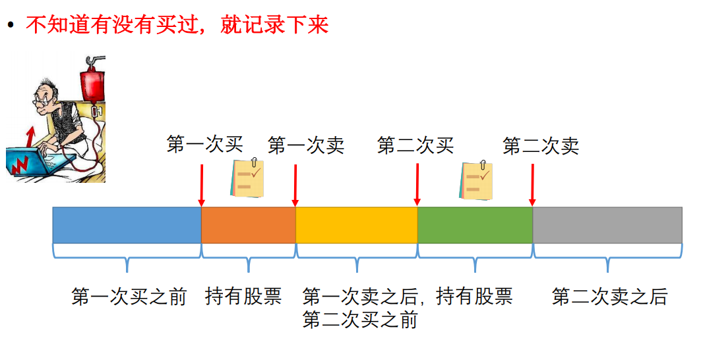
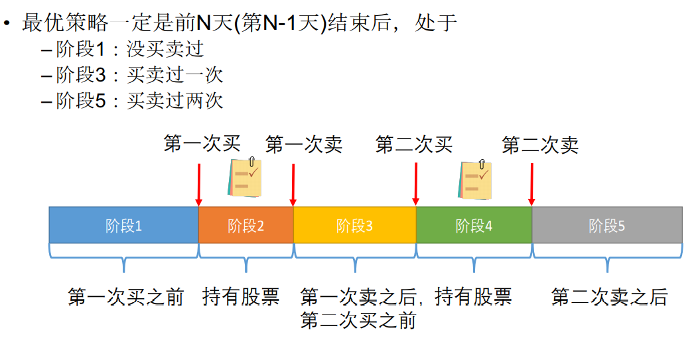
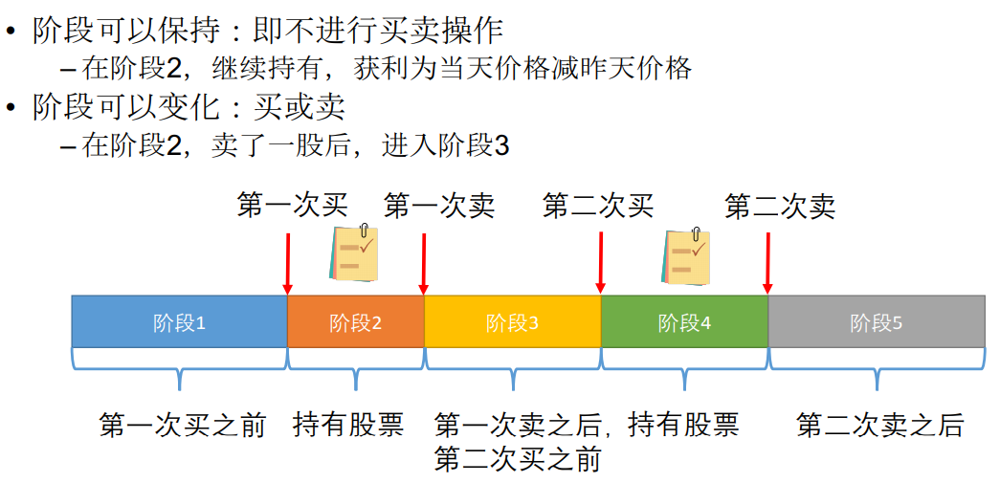
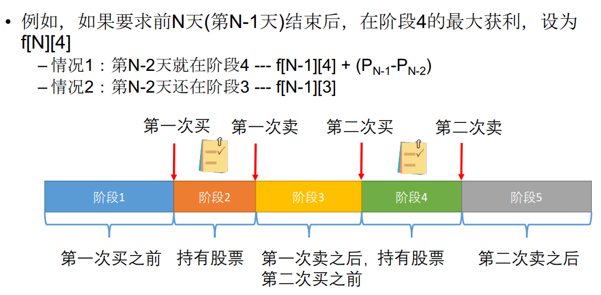
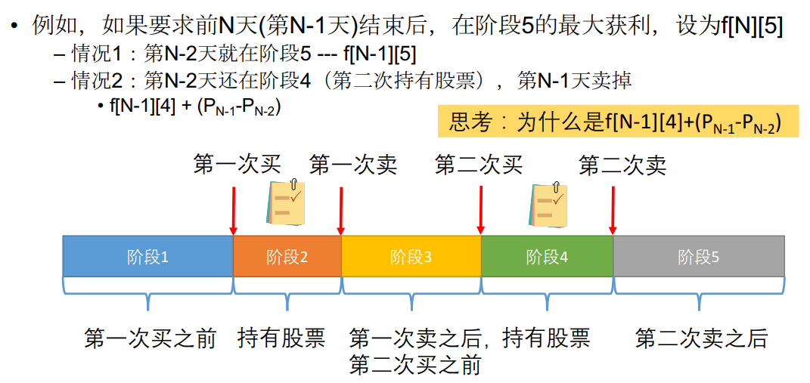
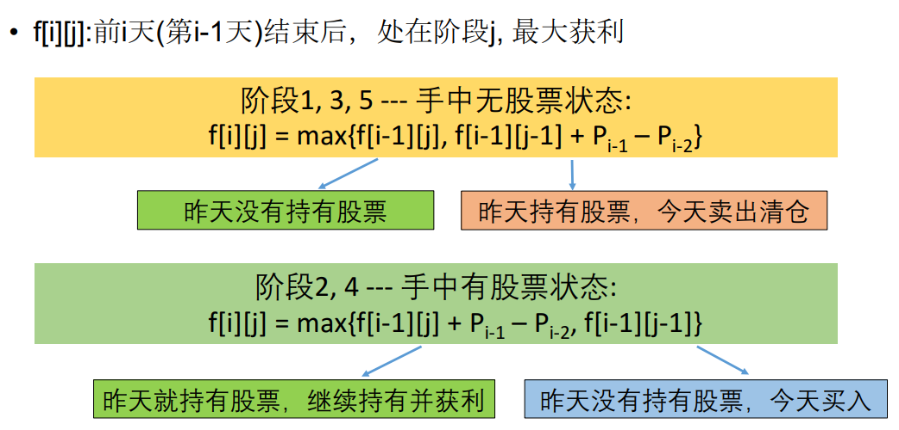

因为最多只能进行买卖两次，所以我们会处于下图中的五个阶段。



而最终，我们获利的一定是手中没有股票的阶段1，3，5这三个阶段。




（2）第2阶段



（3）阶段4



（4）阶段5




动态规划的转移方程：



```java
public int maxProfit(int[] prices) {
    if(prices == null || prices.length < 2)
        return 0;
    int n = prices.length;
    int[][] dp = new int[n + 1][5 + 1];

    for(int i = 0; i < 5; i++){
        dp[0][i] = 0;
    }
    // 每一天
    for(int i = 1; i <= n; i++){
        // 1,3,5
        for(int j = 1; j <= 5; j += 2){
            // 1.昨天就是j状态
            dp[i][j] = dp[i-1][j];
            // 2.今天进入j状态
            if(j > 1 && i > 1) // 如果是第1阶段，则没有下面这步
                dp[i][j] = Math.max(dp[i][j], dp[i-1][j-1] + prices[i-1] - prices[i-2]);
        }
        // 2,4
        for(int j = 2; j <= 4; j += 2){
            // 1.今天进入j阶段
            dp[i][j] = dp[i-1][j-1];
            // 2.昨天就出于j阶段
            if(i > 1)
                dp[i][j]  = Math.max(dp[i][j] , dp[i-1][j] + prices[i-1] - prices[i-2]);
        }
    }
    return Math.max(dp[n][1], Math.max(dp[n][5], dp[n][3]));
}
```


