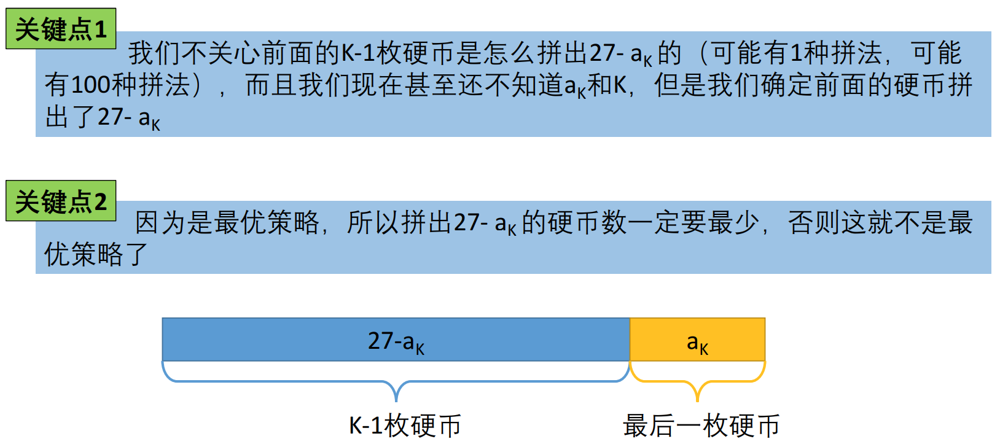

## 换硬币

### 题目链接

[换硬币](https://www.lintcode.com/problem/669/)

### 题目描述

给出不同面额的硬币以及一个总金额。 写一个方法来计算给出的总金额可以换取的最少的硬币数量. 如果已有硬币的任意组合均无法与总金额面额相等, 那么返回 `-1`.

```
你可以假设每种硬币均有无数个
总金额不会超过10000
硬币的种类数不会超过500, 每种硬币的面额不会超过100
```

**样例1**

```shell
输入：
[1, 2, 5]
11
输出： 3
解释： 11 = 5 + 5 + 1
```

**样例2**

```shell
输入： 
[2]
3
输出： -1
```

### 解题思路

最值问题，通常使用动态规划求解。动态规划四步走：


### 1.确定状态

状态在动态规划中属于定海神针，简单来说，解动态规划的时候需要开一个数组，数组的每一个元素f[i]代表什么。类似于解数学题中的x，y，z代表什么。

### 1.1 最后一步


虽然我们不知道最优策略是什么，但是最优策略肯定是：

* 最后一枚硬币为ak
* K-1个硬币，和为27 - ak




### 1.2  子问题

根据最后一步的分析，我们的问题变成：最少用多少枚硬币可以拼出27-ak。

原问题是：最找多少枚硬币拼出27。

我们将原问题转化成了一个子问题，而且规模更小：27-ak

为了简化定义，我们设状态：

```shell
f(x) = 最找用多少枚硬币拼出x
```


### 2.转移方程

设状态方程为：

```shell
f(x) = 最找用多少枚硬币拼出x
```

那么，对于任意x，有如下方程：


### 3.初始条件和边界情况

状态转移方程为：

```shell
f(x) = min{f(x - 2) + 1, f(x - 5) + 1, f(x - 7) + 1}
```

那么，存在的问题是，如果f(x - 2) , f(x - 5) , f(x - 7)小于0怎么办？什么时候停下来呢？

如果不能拼出y，那么就定义f(y) = 正无穷大。

初始条件：f(0) = 0.

### 4.计算顺序


（1）计算f(1)


（2）计算f(2)


（3）计算f(3)


（4）计算f(4)


（4）计算f(27)


### 5.动态规划总结


### 6.代码实现

```java
public int coinChange(int[] coins, int amount) {
    // write your code here
    int[] dp = new int[amount + 1];
    dp[0] = 0;

    for(int i = 1; i <= amount; i++){
        dp[i] = Integer.MAX_VALUE;
        for(int j = 0; j < coins.length; j++){
            if(i - coins[j] >= 0 && dp[i - coins[j]] != Integer.MAX_VALUE){
                dp[i] = Math.min(dp[i], dp[i - coins[j]] + 1);
            }
        }
    }
    if(dp[amount] == Integer.MAX_VALUE)
        return -1;
    return dp[amount];
}
```


