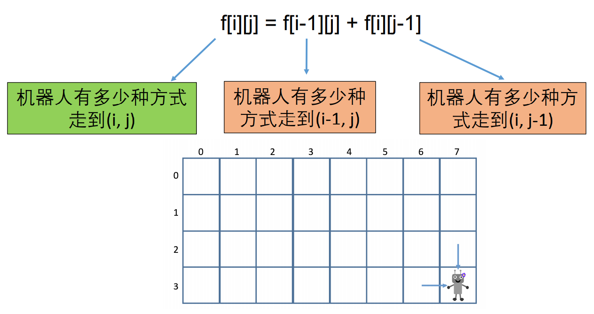

## 不同的路径

### 题目链接

[不同的路径](https://www.lintcode.com/problem/114/)

### 题目描述

有一个机器人的位于一个 m × n*m*×*n* 个网格左上角。

机器人每一时刻只能向下或者向右移动一步。机器人试图达到网格的右下角。

问有多少条不同的路径？

```
n和m均不超过100
且答案保证在32位整数可表示范围内。
```

**样例1**

```shell
输入：
n = 1
m = 3
输出： 1
解释： 只有一条通往目标位置的路径。
```

**样例2**

```shell
输入： 
n = 3
m = 3
输出： 6
```

### 解题思路

计数型问题，通常使用动态规划求解。



代码实现：

```java
public int uniquePaths(int m, int n) {
    int[][] dp = new int[m][n];
    for(int i = 0; i < m; i++){
        for(int j = 0; j < n; j++){
            dp[i][j] = 0;
            if(i == 0 || j == 0){
                dp[i][j] = 1;
                continue;
            }
            dp[i][j] = dp[i-1][j] + dp[i][j-1];
        }
    }
    return dp[m-1][n-1];
}
```

