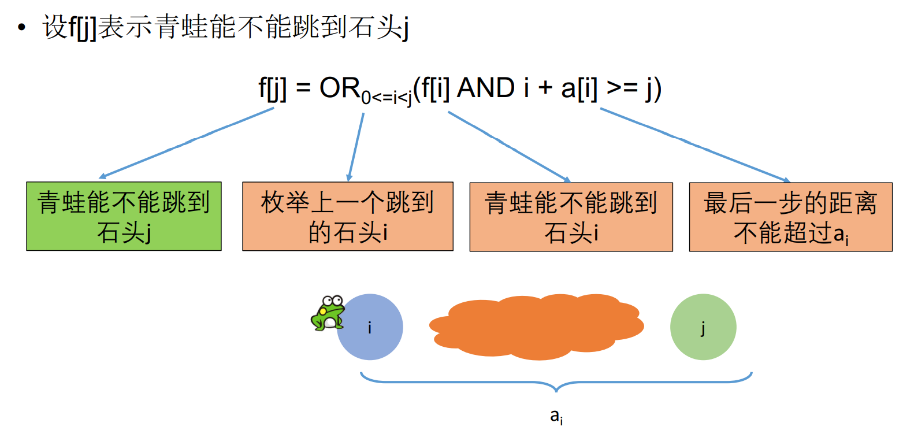

## 跳跃游戏

### 题目链接

[跳跃游戏](https://www.lintcode.com/problem/116/)

### 题目描述

给出一个非负整数数组，你最初定位在数组的第一个位置。

数组中的每个元素代表你在那个位置可以跳跃的最大长度。

判断你是否能到达数组的最后一个位置。

```
数组A的长度不超过5000，每个元素的大小不超过5000
```

**样例1**

```shell
输入：A = [2,3,1,1,4]
输出： true
解释： 0 -> 1 -> 4（这里的数字为下标）是一种合理的方案。
```

**样例2**

```shell
输入： A = [3,2,1,0,4]
输出： false
解释：不存在任何方案能够到达终点。
```

### 解题思路

存在性问题，通常使用动态规划求解。



```java
public boolean canJump(int[] A) {
    // write your code here
    boolean[] dp = new boolean[A.length];
    dp[0] = true;
    for(int i = 1; i < A.length; i++){
        dp[i] = false;
        for(int j = 0; j < i; j++){
            if(dp[j] && (j + A[j]) >= i){
                dp[i] = true;
                break;
            }

        }
    }
    return dp[A.length - 1];
}
```


