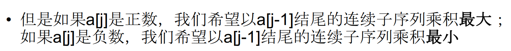
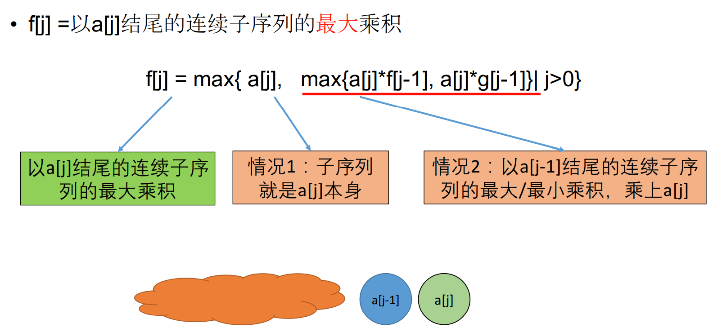
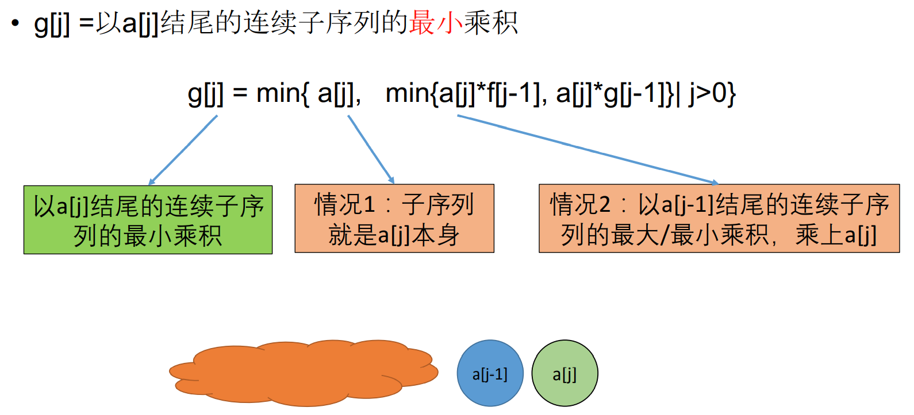
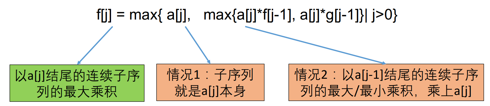

## 乘积最大子序列

### 题目链接

[乘积最大子序列](https://www.lintcode.com/problem/191/)

### 题目描述

找出一个序列中乘积最大的连续子序列（至少包含一个数）。

```
数组长度不超过20000
乘积最大的子序列的积，小于2147483647
```

**样例1**

```shell
输入:[2,3,-2,4]
输出:6
```

**样例2**

```shell
输入:[-1,2,4,1]
输出:8
```

### 解题思路

最值型问题，通常使用动态规划求解。



所以，我们需要同时保留最大乘积和最下乘积。

（1）定义最大值数组



（2）定义最小值数组



（3）状态转移方程



```java
public int maxProduct(int[] nums) {
    int[] maxDP = new int[nums.length];
    int[] minDP = new int[nums.length];
    int max = nums[0];
    maxDP[0] = minDP[0] = nums[0];
    for(int i = 1; i < nums.length; i++){
        maxDP[i] = nums[i];
        minDP[i] = nums[i];

        maxDP[i] = Math.max(maxDP[i], Math.max(maxDP[i - 1] * nums[i], minDP[i - 1] * nums[i]));
        minDP[i] = Math.min(minDP[i], Math.min(maxDP[i - 1] * nums[i], minDP[i - 1] * nums[i]));
        max = Math.max(max, maxDP[i]);
    }
    return max;
}
```

