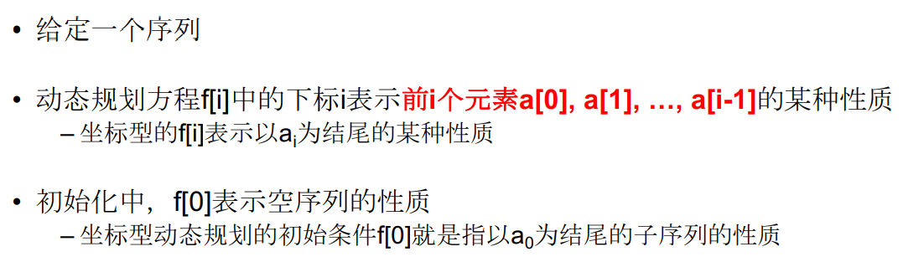
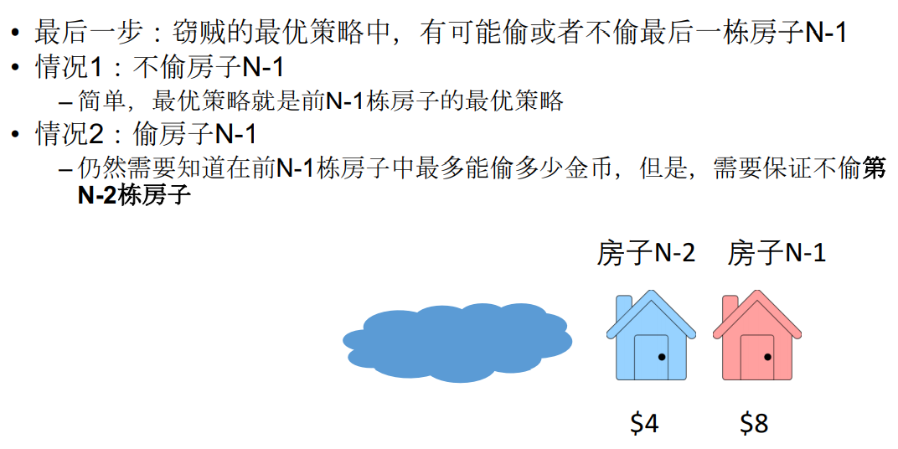

序列型动态规划：



### 

## 最后一步




```javascript
public long houseRobber(int[] A) {
    if(A == null || A.length < 1)
        return 0;
    long[] dp = new long[A.length + 1];
    dp[0] = 0;
    dp[1] = A[0];
    for(int i = 2; i <= A.length; i++){
        dp[i] = Math.max(dp[i-1], dp[i-2] + A[i-1]);
    }
    return dp[A.length];
}
```


