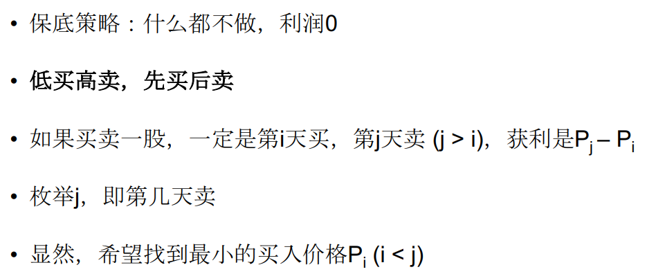

假设有一个数组，它的第i个元素是一支给定的股票在第i天的价格。如果你最多只允许完成一次交易(例如,一次买卖股票),设计一个算法来找出最大利润。

解题思路：因为只能进行一次买卖，所以就选择两天进行交易，一个是最小值买入，最大值卖出即可。




```java
public int maxProfit(int[] prices) {
    if(prices == null || prices.length < 1)
        return 0;
    int max = 0;
    int minPrice = prices[0];
    for(int i = 1; i < prices.length; i++){
        max = Math.max(max, prices[i] - minPrice);
        minPrice = Math.min(minPrice, prices[i]);
    }
    return max;
}
```

