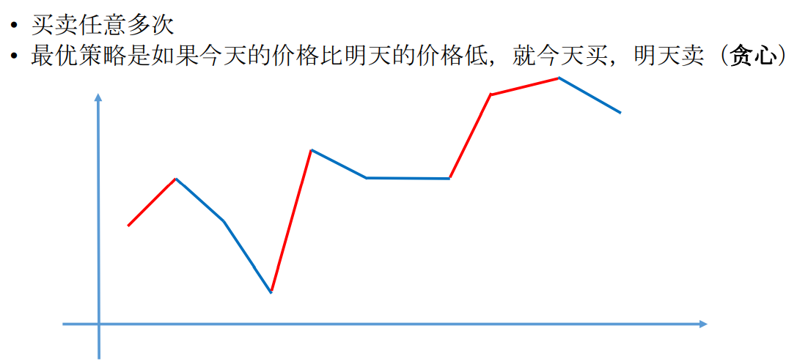

给定一个数组 `prices` 表示一支股票每天的价格。

交易次数不限, 不过你不能同时参与多个交易 (也就是说, 如果你已经持有这支股票, 在再次购买之前, 你必须先卖掉它)。

设计一个算法求出最大的利润。

解题思路：`不限制交易次数`。



```java
public int maxProfit(int[] prices) {
    int res = 0;
    if(prices == null || prices.length < 2)
        return res;
    for(int i = 1; i < prices.length; i++){
        if(prices[i] > prices[i-1]){
            res += prices[i] - prices[i-1];
        }
    }
    return res;
}
```

