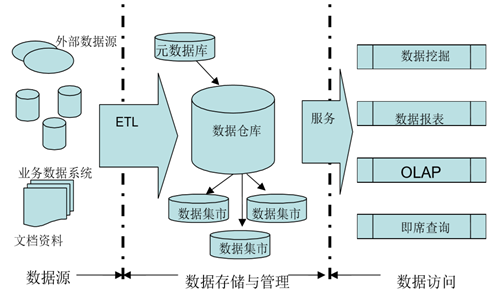

## 什么是数据仓库？

目前，数据仓库一词尚没有一个统一的定义，著名的数据仓库专家W.H.Inmon在其著作《Building the Data Warehouse》一书中给予如下描述：数据仓库（Data Warehouse）是一个面向主题的（Subject Oriented）、集成的（Integrate）、相对稳定的（Non-Volatile）、反映历史变化（Time Variant）的数据集合，用于支持管理决策。对于数据仓库的概念我们可以从两个层次予以理解，

（1）首先，数据仓库用于支持决策，面向分析型数据处理，它不同于企业现有的操作型数据库；

（2）其次，数据仓库是对多个异构的数据源有效集成，集成后按照主题进行了重组，并包含历史数据，而且存放在数据仓库中的数据一般不再修改。

根据数据仓库概念的含义，数据仓库拥有以下四个特点：

1、面向主题

传统数据库主要是为应用程序进行数据处理，未必按照同一主题存储数据；数据仓库侧重于数据分析工作，是按照主题存储的。

这一点，类似于传统农贸市场与超市的区别：1）市场里面，白菜、萝卜、香菜会在一个摊位上，如果它们是一个小贩卖的；2）而超市里，白菜、萝卜、香菜则各自一块。也就是说，市场里的菜(数据)是按照小贩(应用程序)归堆(存储)的，超市里面则是按照菜的类型(同主题)归堆的。 

2、集成的

面向事务处理的操作型数据库通常与某些特定的应用相关，数据库之间相互独立，并且往往是异构的。

而数据仓库中的数据是在对原有分散的数据库数据抽取、清理的基础上经过系统加工、汇总和整理得到的，必须消除源数据中的不一致性，以保证数据仓库内的信息是关于整个企业的一致的全局信息。

3、相对稳定的

操作型数据库中的数据通常实时更新，数据根据需要及时发生变化。数据仓库的数据主要供企业决策分析之用，所涉及的数据操作主要是数据查询，一旦某个数据进入数据仓库以后，一般情况下将被长期保留，**也就是数据仓库中一般有大量的查询操作，但修改和删除操作很少，通常只需要定期的加载、刷新**。

4、反映历史变化

操作型数据库主要关心当前某一个时间段内的数据，而数据仓库中的数据通常包含历史信息，系统记录了企业从过去某一时点(如开始应用数据仓库的时点) 到目前的各个阶段的信息，通过这些信息，可以对企业的发展历程和未来趋势做出定量分析和预测。同样都是累计购买过九车产品的顾客，一位是最近三个月购买九车，一位是最近一年从未买过，这对于决策者意义是不同的。

企业数据仓库的建设，是以现有企业业务系统和大量业务数据的积累为基础。数据仓库不是静态的概念，只有把信息及时交给需要这些信息的使用者，供他们做出改善其业务经营的决策，信息才能发挥作用，信息才有意义。

而把信息加以整理归纳和重组，并及时提供给相应的管理决策人员，是数据仓库的根本任务。因此，从产业界的角度看，数据仓库建设是一个工程，是一个过程。 

下图是一个典型的企业数据仓库系统，通常包含数据源、数据存储与管理、数据的访问三个部分：

（1）数据源：是指企业操作型数据库中的各种生产运营数据、办公管理数据等内部数据和一些调查数据、市场信息等来自外环境的数据总称。这些数据是构建数据仓库系统的基础是整个系统的数据源泉。

（2）数据的存储与管理：数据仓库的存储主要由元数据的存储及数据的存储两部分组成。元数据是关于数据的数据，其内容主要包括数据仓库的数据字典、数据的定义、数据的抽取规则、数据的转换规则、数据加载频率等信息。各操作数据库中的数据按照元数据库中定义的规则，经过抽取、清理、转换、集成，按照主题重新组织，依照相应的存储结构进行存储。也可以面向应用建立一些数据集市，数据集市可以看作是数据仓库的一个子集，它含有较少的主题域且历史时间更短数据量更少，一般只能为某个局部范围内的管理人员服务，因此也称之为部门级数据仓库。

（3）数据的访问：由OLAP（联机分析处理）、数据挖掘、统计报表、即席查询等几部分组成。

例如OLAP：针对特定的分析主题，设计多种可能的观察形式，设计相应的分析主题结构（即进行事实表和维表的设计），使管理决策人员在多维数据模型的基础上进行快速、稳定和交互性的访问，并进行各种复杂的分析和预测工作。

按照存储方式来分，OLAP可以分成MOLAP以及ROLAP等方式，

* MOLAP (Multi-Dimension OLAP)将OLAP分析所需的数据存放在多维数据库中。分析主题的数据可以形成一个或多个多维立方体。
* ROLAP (Relational OLAP)将OLAP分析所需的数据存放在关系型数据库中。分析主题的数据以“事实表-维表”的星型模式组织。

